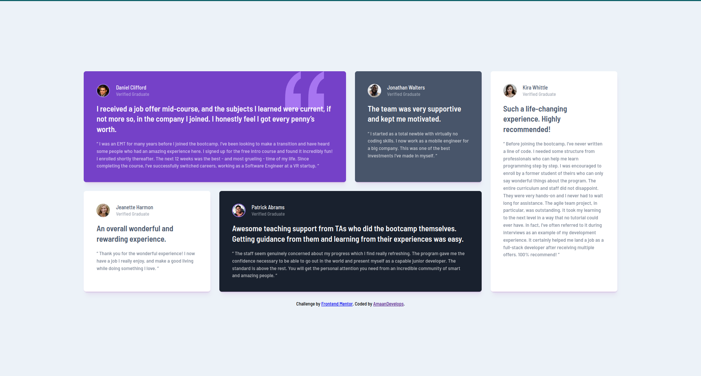

# Frontend Mentor - Testimonials grid section solution

This is a solution to the [Testimonials grid section challenge on Frontend Mentor](https://www.frontendmentor.io/challenges/testimonials-grid-section-Nnw6J7Un7). Frontend Mentor challenges help you improve your coding skills by building realistic projects. 

## Table of contents

- [Overview](#overview)
  - [The challenge](#the-challenge)
  - [Screenshot](#screenshot)
  - [Links](#links)
- [My process](#my-process)
  - [Built with](#built-with)
  - [What I learned](#what-i-learned)
  - [Continued development](#continued-development)
- [Author](#author)

## Overview

### The challenge

Users should be able to:

- View the optimal layout for the site depending on their device's screen size

### Screenshot



### Links

- Solution URL: [Add solution URL here](https://www.frontendmentor.io/solutions/responsive-layout-using-css-grid-Ak0mS8J0Ab)
- Live Site URL: [Add live site URL here](https://clever-puffpuff-a555c2.netlify.app/)

## My process

### Built with

- Semantic HTML5 markup
- CSS custom properties
- Flexbox
- CSS Grid
- Mobile-first workflow

### What I learned

During this intriguing coding challenge, I had the wonderful opportunity to delve into the fascinating world of CSS grids. Through this experience, I acquired a comprehensive understanding of CSS grids, grid layouts, and grid template areas. These remarkable features opened up a whole new dimension of tackling web layout complexities, granting me greater control and flexibility in solving the coding challenge with visually stunning and responsive solutions.

```css
/* Grid */

.testimonials--grid {
  display: grid;
  grid-auto-columns: 1fr;
  gap: 1.5rem;
  grid-template-areas: 
  'one'
  'two'
  'three'
  'four'
  'five';
} 

.testimonials__1 {
  grid-area: one;
}

.testimonials__2 {
  grid-area: two;
}

.testimonials__3 {
  grid-area: three;
}

.testimonials__4 {
  grid-area: four;
}

.testimonials__5 {
  grid-area: five;
}

@media (min-width: 40em) { 
  .testimonials--grid {
    grid-template-areas: 
      'one   one   two'
      'three five  five '
      'four four four';
    }
}

@media (min-width: 70em) { 
  .testimonials--grid {
    grid-template-areas: 
      'one   one  two  five'
      'three four four five';
    }
}

/* Grid */

```

### Continued development

I am eager to take my web development abilities to the next level, and an area I am particularly keen on enhancing is my proficiency in CSS grids. Through my recent learning experiences, I have already gained a solid foundation in utilizing CSS grids effectively, but I am determined to go even deeper into this powerful layout system.

## Author

- Frontend Mentor - [@AmaanDevelops](https://www.frontendmentor.io/profile/amaandevelops)
- Twitter - [@AmaanDevelops](https://www.twitter.com/amaandevelops)
